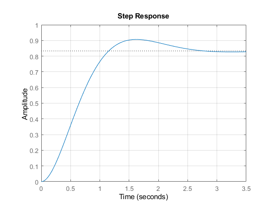

# PID_Controller
A simple PID controller written in MATLAB

## Introduction
Simulations containing data tables and graphs for the following P, I, and D values ignores disturbance.
Formula of PID controller is provided below:

While for MATLAB, another simplified formula is provided as well:

### Modify P parameter
I=D=0;\
P=4

P=5

### Modify D parameter
P=3, I=0.5;\
When D=0

When D=5

When D=-2

## Conclusion
As the value of derivatives increases, the final value becomes to merge in faster rate. If the value of derivatives is negative, the model is fluctuating around the set point.
## Reference
- https://www.section.io/engineering-education/pid-controllers-using-matlab/ 

 